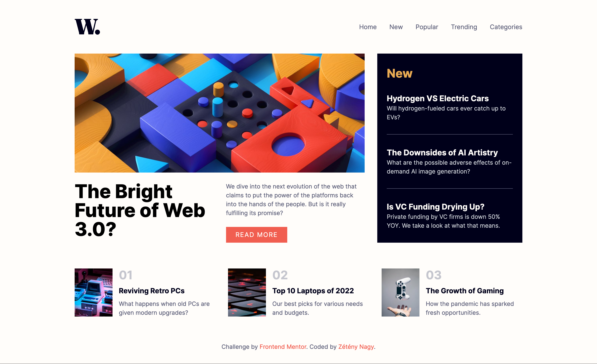
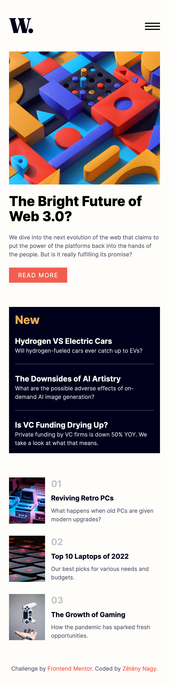

# Frontend Mentor - News homepage solution

This is a solution to the [News homepage challenge on Frontend Mentor](https://www.frontendmentor.io/challenges/news-homepage-H6SWTa1MFl). Frontend Mentor challenges help you improve your coding skills by building realistic projects.

## Table of contents

- [Overview](#overview)
  - [The challenge](#the-challenge)
  - [Screenshots](#screenshots)
  - [Links](#links)
- [Built with](#built-with)
- [TODO](#todo)

## Overview

### The challenge

Users should be able to:

- View the optimal layout for the interface depending on their device's screen size
- See hover and focus states for all interactive elements on the page

### Screenshots

### Links

- Solution URL: [github.com/stay-js/fm-news-homepage](https://github.com/stay-js/fm-news-homepage)
- Live Site URL: [fm-news.znagy.hu](https://fm-news.znagy.hu)

## Built with

- **Deployment**: [Netlify](https://www.netlify.com)
- [Astro](https://astro.build)
- [Tailwind CSS](https://tailwindcss.com)

## TODO

- [ ] Fix image responsiveness
- [ ] Simplify code
- [ ] Hamburger menu animation
- [ ] Maybe add meta tags
